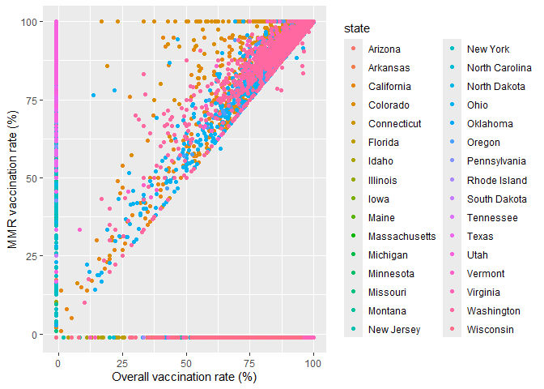
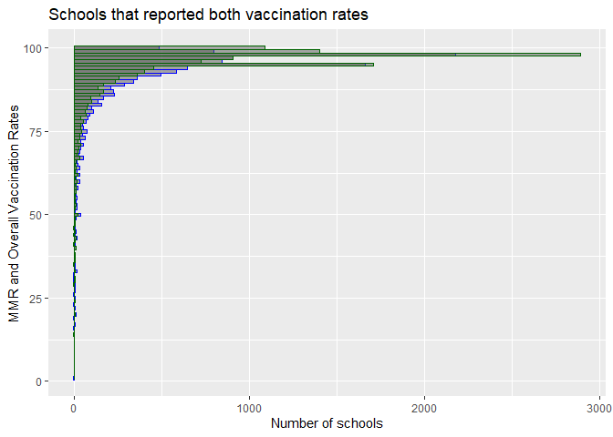
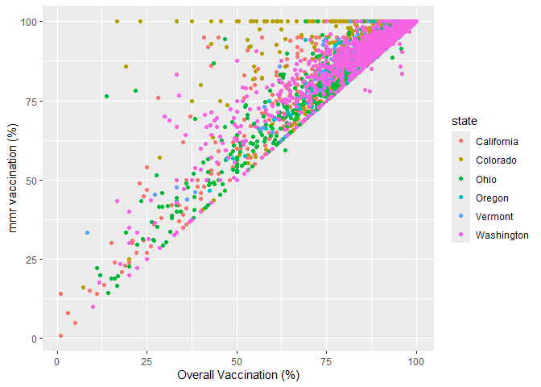
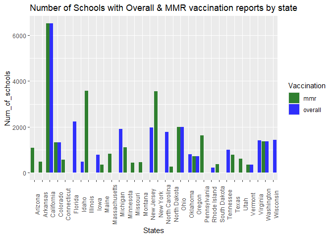

US SChools Measles Immunization Exploration
================
Pallavi Rane
2024-05-11

#### This R markdown explores the records of overall and MMR immunization from 46410 schools from 32 US states between 2017 and 2019.

##### Built with R version 4.4.0

<br> Table of Contents

- [1. Data Cleaning](#chapter1)  
  Data acquisition and clean up with updated code to avoid duplication
  - [1.1 Additing geolocation](#section_1_1)  
  - [1.2 Correcting longitudes](#section_1_2)  
- [2. Data Review](sSection_1_2)  
  Review the data for missing values.
  - [Section 2.1](#section_2_1)  
- [3. Data Transformation](#chapter2)  
  Modifying the data to look at state-wise statistics
  - [Section 3.1](#section_3_1)

<figure>

<figcaption aria-hidden="true">Tableau generated image of statewise
analysis</figcaption>
</figure>

``` r
library(tidyverse)  
```

    ## ── Attaching core tidyverse packages ──────────────────────── tidyverse 2.0.0 ──
    ## ✔ dplyr     1.1.4     ✔ readr     2.1.5
    ## ✔ forcats   1.0.0     ✔ stringr   1.5.1
    ## ✔ ggplot2   3.5.1     ✔ tibble    3.2.1
    ## ✔ lubridate 1.9.3     ✔ tidyr     1.3.1
    ## ✔ purrr     1.0.2     
    ## ── Conflicts ────────────────────────────────────────── tidyverse_conflicts() ──
    ## ✖ dplyr::filter() masks stats::filter()
    ## ✖ dplyr::lag()    masks stats::lag()
    ## ℹ Use the conflicted package (<http://conflicted.r-lib.org/>) to force all conflicts to become errors

``` r
library(rvest)  
```

    ## 
    ## Attaching package: 'rvest'
    ## 
    ## The following object is masked from 'package:readr':
    ## 
    ##     guess_encoding

``` r
library(dplyr)  
library(ggplot2)  
library(pivottabler)  
  
`%notin%` <- Negate(`%in%`)  

##If you are downloading the code and running it locally, set the working directory to where the dataset is located  
#setwd("C:/..../GoogleDataAnalyticsCapstoneProject")  
```

“This repository contains immunization rate data for schools across the
U.S., as compiled by [The Wall Street
Journal](https://github.com/WSJ/measles-data). The dataset includes the
overall and MMR-specific vaccination rates for 46,412 schools in 32
states. As used in [“What’s the Measles Vaccination Rate at Your Child’s
School?”](https://www.wsj.com/graphics/school-measles-rate-map/).

Vaccination rates are for the 2017-18 school year for Colorado,
Connecticut, Minnesota, Montana, New Jersey, New York, North Dakota,
Pennsylvania, South Dakota, Utah and Washington. Rates for other states
are 2018-19.”

The cleaning process produces a .csv file with followig columns:

| variable | class     | description                                                            |
|:---------|:----------|:-----------------------------------------------------------------------|
| index    | double    | Index ID                                                               |
| state    | character | School’s state                                                         |
| year     | character | School academic year                                                   |
| name     | character | School name                                                            |
| type     | character | Whether a school is public, private, charter                           |
| city     | character | City                                                                   |
| county   | character | County                                                                 |
| district | character | School district                                                        |
| enroll   | double    | Enrollment                                                             |
| mmr      | double    | School’s Measles, Mumps, and Rubella (MMR) vaccination rate            |
| overall  | double    | School’s overall vaccination rate                                      |
| xrel     | double    | Percentage of students exempted from vaccination for religious reasons |
| xmed     | double    | Percentage of students exempted from vaccination for medical reasons   |
| xper     | double    | Percentage of students exempted from vaccination for personal reasons  |
| lat      | double    | Lattitude                                                              |
| lng      | double    | Longitude                                                              |

## 1. Data Cleanup :<a class="anchor"  id="chapter1"></a>

#### Following code adds latitude and longitude to the dataset.

The initial cleaning code from
[tidytuesday](https://github.com/rfordatascience/tidytuesday/blob/master/data/2020/2020-02-25/readme.md)
had to be modified because

- It was resulting in an error, possibly because the page where [the
  list of URLs for individual
  states](https://github.com/WSJ/measles-data/tree/master/individual-states)
  was coming from has changed since the code was published.

- When we were adding the latitude and longitude data from the states to
  the original vaccination file, it was being done only with school name
  and if one state had multiple schools with the same name, that was
  leading to a many to many matching, resulting in a cartesian matching
  and duplication.)

``` r
# url_wsj <- "https://raw.githubusercontent.com/WSJ/measles-data/master/all-measles-rates.csv"
# 
# wsj <- read_csv(url_wsj)
# 
# list_of_urls <- "https://github.com/WSJ/measles-data/tree/master/individual-states"
# 
# raw_states <- list_of_urls %>% 
#   read_html() %>% 
#   html_table() %>% 
#   .[[1]] %>% 
#   select(1) %>%  #changed select(Name) to select(1) becase there were three columns with headers 'Name'
#   mutate(Name = str_remove(Name, "\\.csv")) %>% 
#   filter(str_length(Name) > 3, str_length(Name) < 20) %>% 
#   pull(Name)
# 
# raw_states=raw_states[2:32] # had to add this line of code because the first element on the list was "parent directory.."  and the last, 33rd element was "View all files"
# 
# all_states <- glue::glue("https://raw.githubusercontent.com/WSJ/measles-data/master/individual-states/{raw_states}.csv") %>% 
#   map(read_csv)
```

As it turns out, not every state had city, county, and district
information included in the individual datasets. Hence in the original
code was matching based on just the name of the school and state. This
was leading to cross matching in states where multiple schools with same
name were present

``` r
##Do not use this code, use the next block with updated version
## clean_states <- all_states %>%
##   map(~select(., state, name, lat, lng)) %>%  
##   map(~mutate_at(., vars(lat, lng), as.numeric)) %>%
##   bind_rows() %>%
##   filter(!is.na(lat))
```

Hence added as many parameters that could have been added out of
“state”, “name”, “district”, “county”, “city” for each state

``` r
# clean_states <- all_states %>% 
#   map(~select(., tidyselect::any_of(c("state", "name", "district", "county", "city", "lat","lng")))) %>% 
#   map(~mutate_at(., vars(lat, lng), as.numeric)) %>% 
#   bind_rows() %>% 
#   filter(!is.na(lat))
# 
# wsj1 <- wsj %>% 
#   left_join(clean_states, by = c("name", "state","district", "county", "city"))
```

Creating a new identifier to remove duplications

``` r
#wsj1=mutate(wsj1,new_id=paste0(state,year,name,type,city,county,district,enroll,mmr,overall,xrel,xmed,xper)) 
#wsj1=wsj1[!duplicated(wsj1$new_id),]
```

You can save the dataset as

``` r
#write_csv(select(wsj1,-"new_id"),"measles_nonduplicated.csv")
```

Looking at the data on Tableau revealed another problem with the data.
86 of the records, 3 from Florida and 83 from Vermont, had incorrect
longitudes,  
  
and this problem persisted in the source files where the latitudes and
longitudes were taken from.

Upon checking with google maps, it was clear that in some cases the
longitudes were marked as +ve where should have been -ve. However, in
most coases, it looked like the lattitudes were incorrectly entered as
longitudes. Since it was not possible to correct each and every case
manually, it was decided that for these 86 cases, the incorrect
longitudes would be replaced with generated longitudes usually assigned
to the respective state by Tableau. Tableau assigns -72.7678 to Vermont
and -81.55 to Florida.

## 2. Data review :<a class="anchor"  id="chapter2"></a>

``` r
#Read your locally saved file
vacc_rec=read_csv("measles_nonduplicated.csv")
```

    ## Rows: 46410 Columns: 16
    ## ── Column specification ────────────────────────────────────────────────────────
    ## Delimiter: ","
    ## chr (7): state, year, name, type, city, county, district
    ## dbl (9): index, enroll, mmr, overall, xrel, xmed, xper, lat, lng
    ## 
    ## ℹ Use `spec()` to retrieve the full column specification for this data.
    ## ℹ Specify the column types or set `show_col_types = FALSE` to quiet this message.

##### Checking for any NAs in mmr and overall column

``` r
length(vacc_rec$mmr[is.na(vacc_rec$mmr)])
```

    ## [1] 0

``` r
length(vacc_rec$overall[is.na(vacc_rec$overall)])
```

    ## [1] 0

#### Lack of report from a school is represented as -1 in this dataset.

#### 20176 or 43.47 % of schools did not report overall vaccination rates.

#### 18087 or 38.97 % of schools did not report mmr vaccination rates.

``` r
ggplot(data = vacc_rec) +
  geom_point(mapping = aes(x = overall, y = mmr, color=state)) +
  labs(x=('Overall vaccination rate (%)'),y='MMR vaccination rate (%)')
```


<br><br>

#### 26234 or 56.53 % of the schools reported overall vaccination rates.

#### 91.84 % of the schools that reported overall vaccinations had 80% or more of the kids vaccinated and <br>Only 1.28 % of the schools had overall vaccinataion rate under 50%.

``` r
ggplot(data=vacc_rec[vacc_rec$overall!=-1,],aes(y=overall))+
  geom_histogram(binwidth=1,color="blue",alpha=0.5) +
  labs(title='Number of Schools vs % of students with overall vaccination', x='Number of schools',y='Overall Vaccination (%)')
```

<!-- -->
<br>

#### 28323 or 61.03 % of the schools reported their MMR vaccination rates.

#### 94.21 % of the schools that reported mmr vaccinations had 80% or more of the kids vaccinated and <br>only 0.89 % of the schools had vaccinataion rate under 50%.

``` r
ggplot(data=vacc_rec[vacc_rec$mmr!=-1,], aes(y=mmr)) +
  geom_histogram(binwidth=1, color="darkgreen",alpha=0.5)+
  labs(title='Number of Schools vs % of students with MMR vaccination', x='Number of schools',y='MMR Vaccination (%)')
```

<!-- -->
<br><br>

#### 12252 or 26.4 % of the schools reported both vaccination rates.

``` r
ggplot() +
  geom_histogram(data=vacc_rec[vacc_rec$overall!=-1& vacc_rec$mmr!=-1,],aes(y=overall),binwidth=1,color="blue", alpha=0.5) +
  geom_histogram(data=vacc_rec[vacc_rec$overall!=-1& vacc_rec$mmr!=-1,], aes(y=mmr),binwidth=1, color="darkgreen", alpha=0.5) +
  labs(title="Schools that reported both vaccination rates", y="MMR and Overall Vaccination Rates", x='Number of schools')
```

<!-- -->

``` r
ggplot(data = vacc_rec[vacc_rec$overall!=-1 & vacc_rec$mmr!=-1,]) +
       geom_point(mapping = aes(x = overall, y = mmr, color=state)) +
      labs(Title='MMR vs Overall vaccination percentages', x= 'Overall Vaccination (%)', y='mmr vaccination (%)')
```

<!-- -->

## 3. Data transformation :<a class="anchor"  id="chapter3"></a>

#### Creating a temporary table to run the summarize function on

``` r
tmpdata=vacc_rec[vacc_rec$overall!=-1 | vacc_rec$mmr!=-1,]
tmpdata$overall[tmpdata$overall==-1]<-NA
tmpdata$mmr[tmpdata$mmr==-1]<-NA
tmpdata=mutate(tmpdata,
               mmr_count=ifelse(is.na(mmr),0,1),
               overall_count=ifelse(is.na(overall),0,1)) #created separate columns in order to count number of schools with a given stat

#Creating the pivot table
Summary_stats<- tmpdata %>% group_by(state) %>% 
  summarize(Total_schools = n(), 
            schools_with_mmr = sum(mmr_count), 
            avg_mmr=ifelse(sum(mmr_count)>0, mean(mmr, na.rm = TRUE), NA), 
            min_mmr=ifelse(sum(mmr_count)>0, min(mmr, na.rm = TRUE), NA),
            max_mmr=ifelse(sum(mmr_count)>0, max(mmr, na.rm = TRUE), NA),
            median_mmr=median(mmr, na.rm = TRUE),
            schools_with_overall=sum(overall_count),
            avg_overall=ifelse(sum(overall_count)>0, mean(overall, na.rm = TRUE), NA),
            min_overall=ifelse(sum(overall_count)>0, min(overall, na.rm = TRUE), NA),
            max_overall=ifelse(sum(overall_count)>0, max(overall, na.rm = TRUE), NA),
            median_overall=median(overall, na.rm = TRUE))
```

#### States with reports of MMR vaccinations

Arizona, Arkansas, California, Colorado, Connecticut, Illinois, Maine,
Massachusetts, Minnesota, Missouri, Montana, New York, North Dakota,
Ohio, Oregon, Pennsylvania, South Dakota, Texas, Utah, Vermont,
Washington

#### States with reports of overall vaccinations

California, Colorado, Florida, Idaho, Iowa, Michigan, New Jersey, North
Carolina, Ohio, Oklahoma, Oregon, Rhode Island, Tennessee, Vermont,
Virginia, Washington, Wisconsin

#### States with reports of <u>both</u> vaccinations

California, Colorado, Ohio, Oregon, Vermont, Washington

<br>

###### Currently the write is commented out, you can uncomment it when running locally

``` r
School_cnt_bar_data = as.data.frame(rbind(rename(mutate(Summary_stats[,c("state","schools_with_mmr")],Vaccination = "mmr"),"Num_of_schools"="schools_with_mmr"),
      rename(mutate(Summary_stats[,c("state","schools_with_overall")],Vaccination = "overall"),"Num_of_schools"="schools_with_overall")))

ggplot(data=School_cnt_bar_data) +
  geom_bar(aes(x=state, y=Num_of_schools, fill=Vaccination), stat = "identity", position = "dodge", alpha=0.8) +
  labs(title="Number of Schools with Overall & MMR vaccination reports by state", x="States") + 
  theme(axis.text.x = element_text(angle = 90)) +
  scale_fill_manual(values=c("mmr"="darkgreen","overall" = "blue"))
```

<!-- -->

### 4. Acknowledgements :<a class="anchor"  id="chapter4"></a>

This data originally comes from
[\#tidytuesday](https://github.com/rfordatascience/tidytuesday/blob/master/data/2020/2020-02-25/readme.md)
and is originally from [The Wallstreet
Journal](https://github.com/WSJ/measles-data). They recently published
an [article](https://www.wsj.com/graphics/school-measles-rate-map/)
around 46,412 schools across 32 US States.
